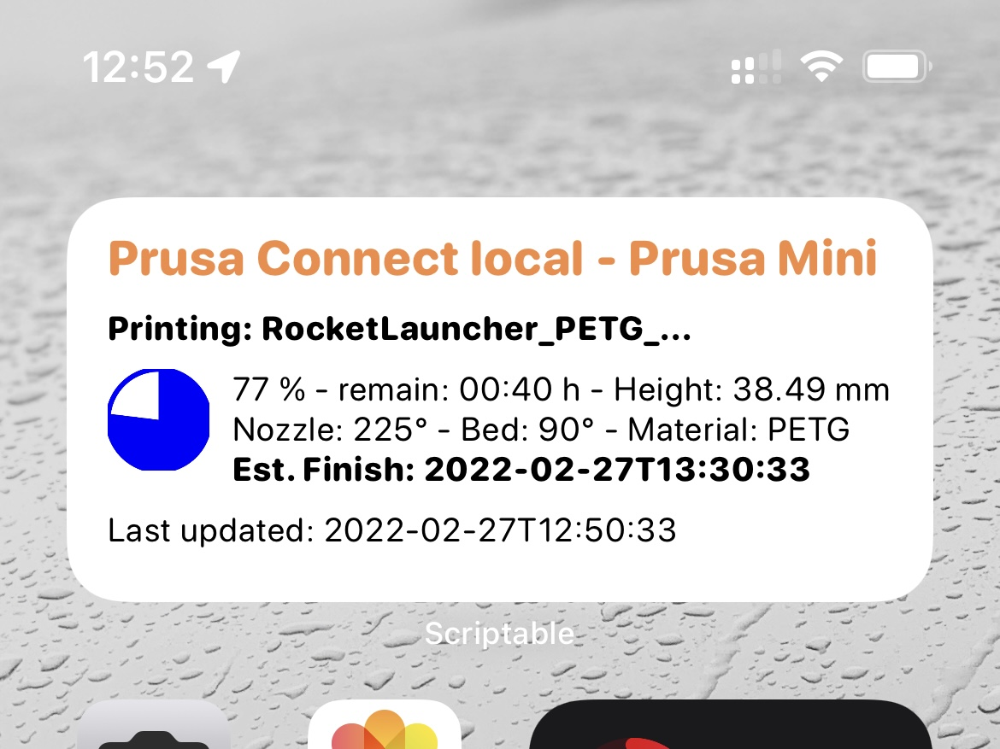
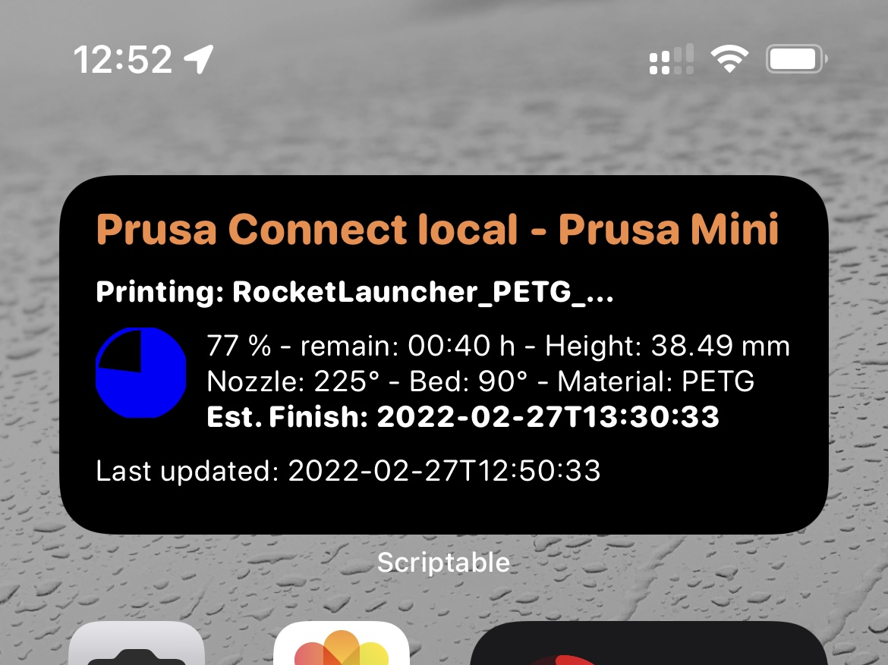
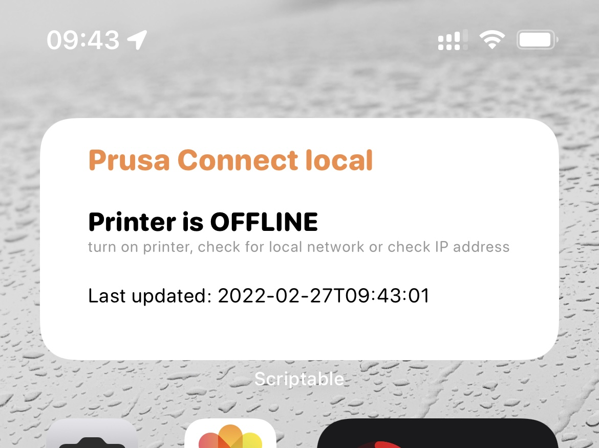
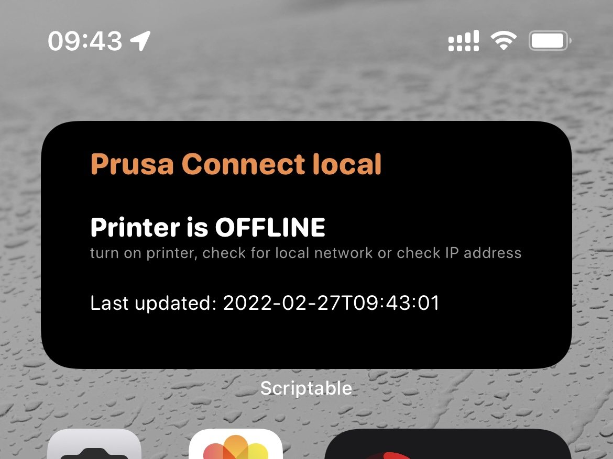
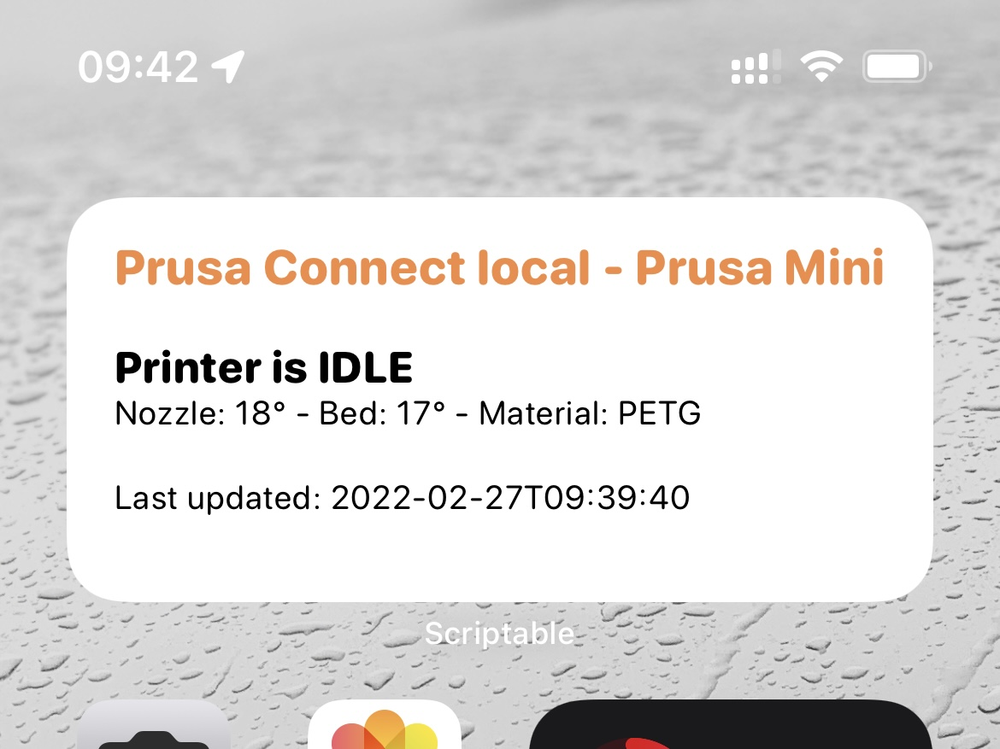
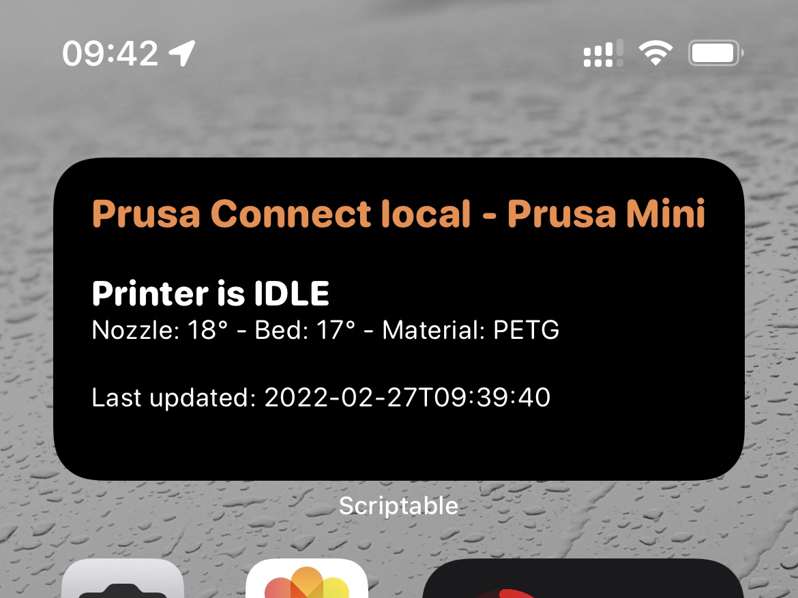

# Scriptable - Prusa Connect local Widget
Widget to show 3D printer details supported by Prusa Connect local API

## Requires
[Scriptable for iOS](https://apps.apple.com/us/app/scriptable/id1405459188)

## Setup
* copy widget to scriptable
* add scriptable widget (medium size) to homescreen
* widget config:
    * Script: choose script
    * When interacting: Run Script
    * Parameter: ip address to prusa printer

## Screenshots

### Printing



### Offline / Not Available



### Idle




## getting into the code
* script is starting with ```main()``` after class definitions
